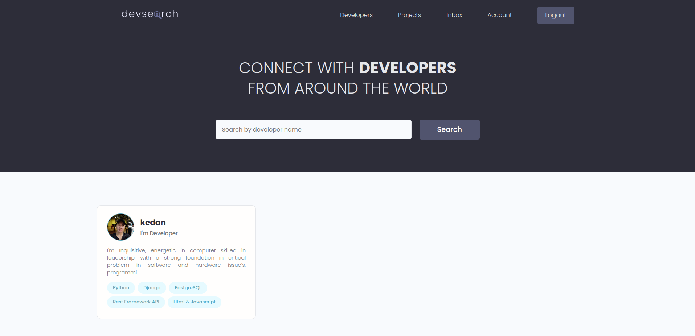

<!-- @format -->

# DevSearch
deploy links on railway: https://web-production-7fd7.up.railway.app
Sourcode and Resources for Django

# Installation

- 1 - clone repo https://github.com/dhanubalde/Django-2023-master.git
- 2 - create a virtual environment and activate
- - pip install virtualenv
- - virtualenv envname
- - envname\scripts\activate
- 3 - cd into project "cd django-2023"
- 4 - pip install -r requirements.txt
- 5 - python manage.py runserver

# Features

- Share Projects
- Message other developers
- Rate others work
- Search other developers

# Course Overview

- Basic Djagno Overview
- Database Design and Models
- Static Files
- User Registration & Authenticaiton
- Search
- Pagination
- Building an API with Django REST Framework (DRF)
- Deployment

# Tech Stack

- Django
- Postgres
- Django REST Framework

# Home Page

# Projects Page

# User Inbox

